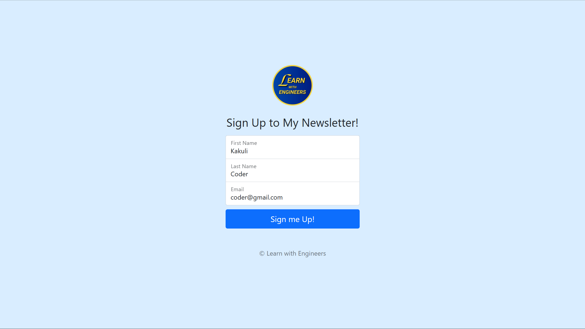
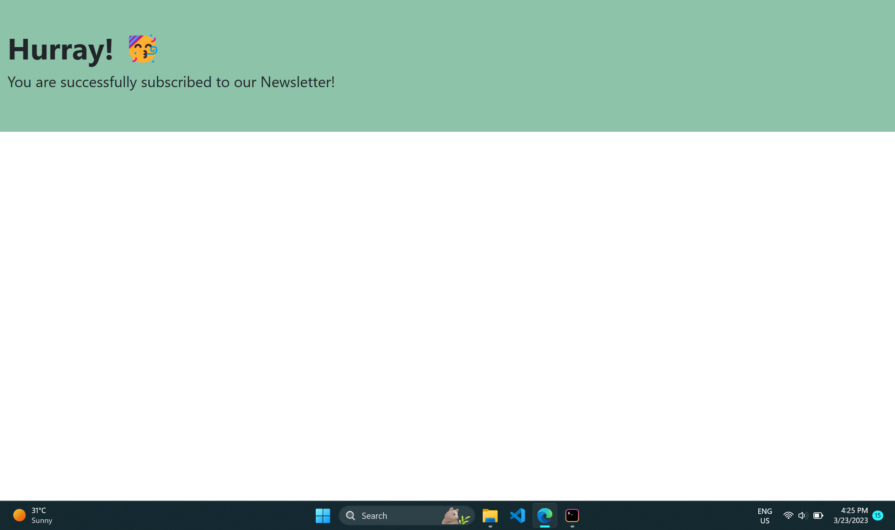
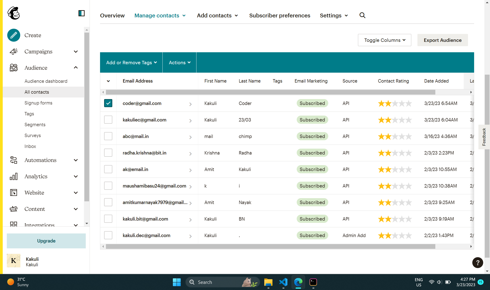

# 📧 Newsletter-Signup

- A Newsletter Signup Page that lets the user subscribe to the Newsletters from 'Learn with Engineers'. 
- The website uses Mailchimp API to send Newsletters to email addresses of subscribers.

## Live Application URL

Go to Deployed Application link 👇 <br />
<a href="https://newsletter-signup-ddej.onrender.com/" alt="App-link" target="_blank">Newsletter Signup</a> </br>

## Newsletter Signup Preview

### Signup Page
 <br />

### Success Page
This page is displayed once you have successfully subscribed to *Learn with Engineers* Newsletter. <br />

 <br />

### Subscribed Audience - Mailchimp
After subscribing to my Newsletter, you are added to the *Audience List* as displayed below. <br />

 <br />


## Prerequisites

 ### Install Node JS
 Refer <a href="https://nodejs.org/en/" alt="node.js-link" target="_blank">Official Website</a> to download and install Node.js

 ### Install nodemon
 Install nodemon npm package globally. This will help to monitor for any changes and automatically restart server. Use the following command to install:

```
npm install -g nodemon
```

## Cloning and Running the Application in local

1. cd to the location in terminal where you want to clone the repository.

```
  cd your_path
```

2. Clone the project into the local:

```
  git clone https://github.com/Kakuli-coder/Newsletter-Signup.git
```

3. Go to the directory:

```
  cd Newsletter-Signup
```
  
4. Install all the npm packages:

```
  npm install
```

5. In order to run the application using 'nodemon', type the following command (Preferred):

```
nodemon app.js 
```

In order to run the application using 'node', type the following command:

```
node app.js 
```

The Application runs on **localhost:3000**
